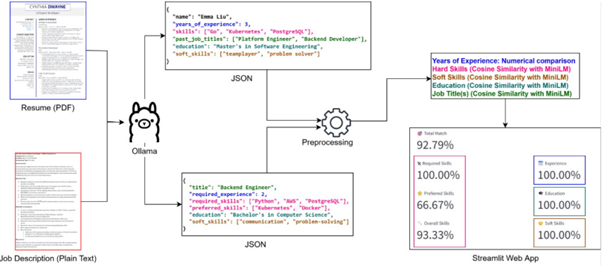

# Résumé Matcher

Résumé Matcher is the result of a project in MSE module TSM_MachLeData.



## Setup Instructions

### 1. Clone the repo
```bash
git clone https://github.com/sambarho/TSM_MLOps.git
cd resume-matcher
```

### 2. Create and activate the Conda environment
```bash
conda create -n resume-matcher python=3.11 pip
conda activate resume-matcher
```
PS: Once you've created the environment initially, you only have to activate it! ;-)

### 3. Install pip dependencies
```bash
pip install -r requirements.txt
```

## Development

### Working on the project
Every time you open the project, first make sure that you are in the __resume_matcher__ directory.
```bash
cd resume-matcher
```

We use:
- `requirements.txt` for deployment (e.g. Streamlit Cloud)
- `environment.yml` for local reproducibility

### Updating Dependencies
**IMPORTANT:** If you install new packages, please **update both** dependency files so the whole team stays in sync.
```bash
pip freeze > requirements.txt
```
Export minimal Conda environment (only what was explicitly installed)
```bash
conda env export --from-history > environment.yml
```
## Run code
### Docker Version (recommended)
If you want to try the very latest version of Résumé Matcher without installing anything locally, simply pull the prebuilt Docker image and run it:

1. Pull the latest image

```bash
docker pull sambarho/tsm-mlops:latest
```
2. Run the container

```bash
docker run --rm -p 8501:8501 sambarho/tsm-mlops:latest
```
- This assumes the app listens on port 8501 (e.g. a Streamlit UI)
- If your app listens on a different port, replace 8501:8501 with HOST_PORT:CONTAINER_PORT.

3. Open your browser
Navigate to http://localhost:8501 (or whatever port you exposed) and you should see the Résumé Matcher interface right away.

### Run from Source
If you want to make changes or see the code in action:
1. Activate your conda env
```bash
cd resume-matcher
conda activate resume-matcher
```

2. From inside the resume-matcher folder:
```bash
streamlit run app/main.py   
```

### Run Tests Locally

With activated environment `resume-matcher`, navigate to directory `resume-matcher` and run the command `pytest`.

### Workflows

The following workflows exist to support the CI/CD process:

- `pytest.yml`
  - is triggered on `push` and `pull request` on all branches
  - runs the automated test suite in `pytest` and uploads a coverage report as `Artifact`
- `docker-publish.yml`
  - is triggered on `push` and `pull request` on branch `main`
  - builds a Docker image, runs a smoke test using a special test entry point, and pushes the image to Docker Hub
