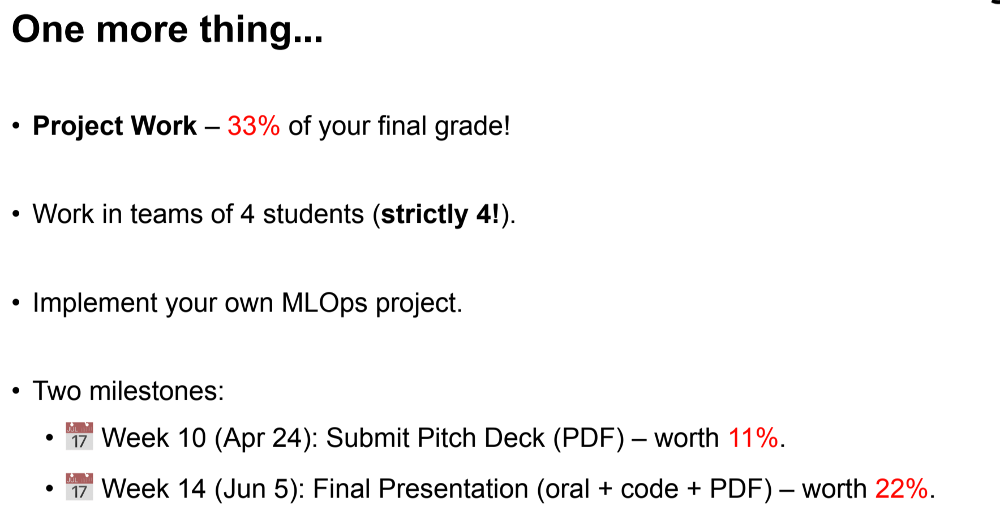
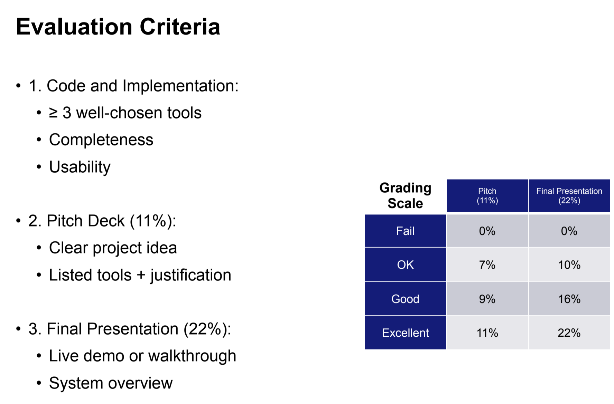
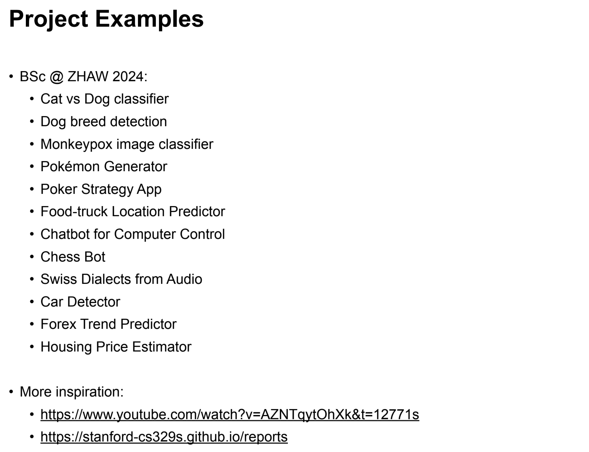
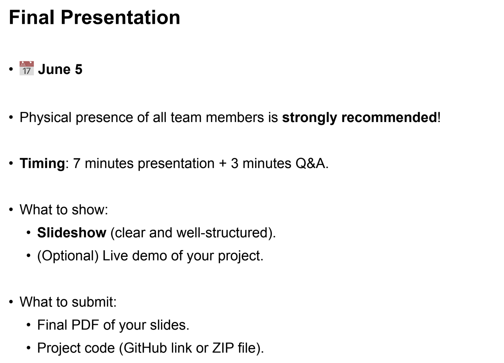
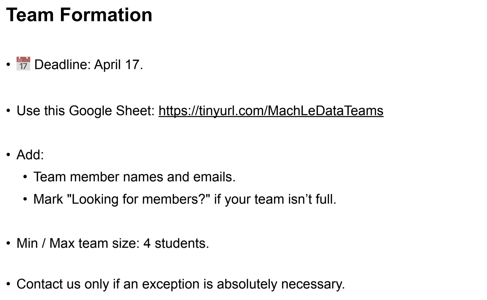

# TSM_MLOps

## 📦 Setup Instructions

### 1. Clone the repo
```bash
git clone https://github.com/sambarho/TSM_MLOps.git
cd resume-matcher
```
### 2. Create and activate the Conda environment
```bashm
conda create -n resume-matcher python=3.11 pip
conda activate resume-matcher
```
PS: Once you've created the environment initially, you only have to activate it! ;-)

### 3. Install pip dependencies
```bash
pip install -r requirements.txt
```

## Updating Dependencies
**IMPORTANT:** If you install new packages, please **update both** dependency files so the whole team stays in sync.
```bash
pip freeze > requirements.txt
```
Export minimal Conda environment (only what was explicitly installed)
```bash
conda env export --from-history > environment.yml
```

## Working on the project
Everytime you open the project, first make sure that you are in the __resume_matcher__ directory.
```bash
cd resume-matcher
```

We use:
- requirements.txt for deployment (e.g., Streamlit Cloud)
- environment.yml for local reproducibility


## Run Tests Locally

With activated environment `resume-matcher`, navigate to directory `resume-matcher` and run the command `resume-matcher`.


## Slides












